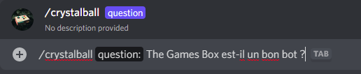

# Boule de crystal

## But du jeu

Le but de ce jeu est en quelque sorte de répondre à n'importe quelle question. Ensuite, le bot va répondre à votre question.


Les réponses du bot sont aléatoires.


## Comment jouer ?

Lorsque vous allez entrer la commande, discord va vous indiquer qu'il faut un argument nommé "Question" dans la commande. C'es ici que vous tapez votre question.


Et voilà ! Vous êtes prêt pour jouer à la boule de Crystal !


